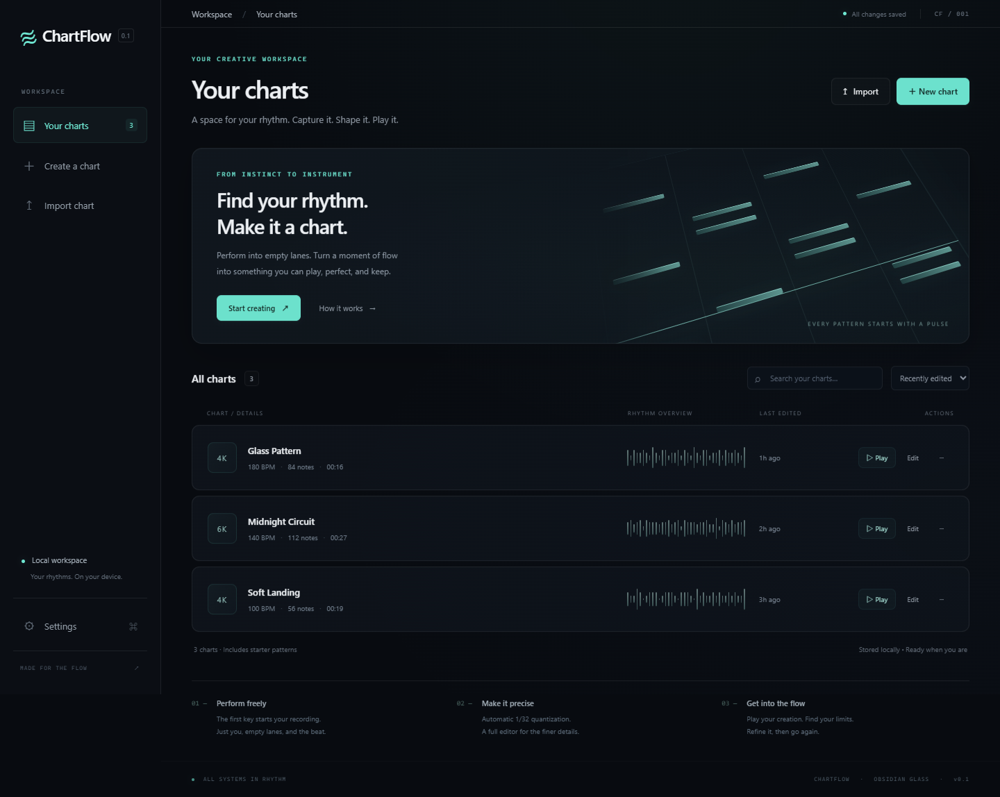

# ChartFlow v0.1

ChartFlow is a client-side rhythm chart creation tool: **perform on empty lanes, press Enter, quantize, then play or edit**. Create 4K-8K charts with a keyboard, refine them in a visual editor, and keep charts and progress in your browser.



## Run locally

Open `index.html` in a modern desktop browser. No dependencies or build step are required to run the app.

For a local HTTP server, install Node.js and run:

```sh
node server.cjs
```

Open <http://127.0.0.1:4173>. Three editable sample charts are included on first launch. Set the `PORT` environment variable to use another port.

Data is stored in IndexedDB for the current browser and origin. Opening the file directly and using the HTTP server creates separate storage spaces. Use JSON export and import to move charts between browsers or addresses.

## Create and play

1. **New chart:** Set the name, lane count (4K-8K), BPM, and scroll speed. Choose **Record a performance** to record input, or **Build from scratch** to open an empty chart in the editor. BPM defines the musical timing and grid alignment.
2. **Record:** The first lane key establishes time zero and starts the metronome. Lanes stay empty and show only key feedback.
3. **Pause:** Press **P** to pause. Press it again to resume after a four-number countdown, with each number lasting 0.7 seconds. Pauses and countdowns are excluded from chart time.
4. **Finish:** Press **Enter** to quantize to a fixed 1/32 grid and open Chart View. Raw input is retained separately. Notes on the same lane and tick are merged, and conflicts are counted.
5. **Play:** A one-second wait is followed by a complete **3, 2, 1** countdown, with each number lasting 0.7 seconds independently of BPM. Notes enter from the top and are judged individually at the fixed judgment line. Press **P** to pause or resume with a countdown, or **Esc** to return.
6. **Edit:** Add, select, move, copy, resnap, and test notes. Changes save automatically after a 650 ms debounce.

### Default lane keys

| Mode | Keys |
| --- | --- |
| 4K | `D F J K` |
| 5K | `D F J K L` |
| 6K | `S D F J K L` |
| 7K | `S D F G J K L` |
| 8K | `A S D F J K L ;` |

Change bindings in **Settings**. P, Enter, Escape, and combinations with Ctrl, Cmd, or Alt are reserved. Physical keys are tracked independently for simultaneous eight-key input. **Key Check** helps identify combinations that your keyboard hardware does not report.

New charts and sample charts default to scroll speed **15**. The **Scroll speed** field in Play and Edit accepts values from **1 to 25**, applies immediately, and saves with the chart. Speed changes affect note travel without changing note ticks, BPM, or raw input. The initial lead-in provides the full travel time from the top of the lanes to the judgment line, including for notes at time zero.

## Editor controls

Musical time increases upward: dragging upward or pressing Up moves notes later; dragging downward or pressing Down moves them earlier.

| Action | Control |
| --- | --- |
| Select | Click a note; Ctrl/Cmd-click or Shift-click toggles multiple selection; drag empty space to marquee-select |
| Add a note | Left-click empty space; the note is added on release and aligned to Snap; alternatively use `+ Note` |
| Move | Drag a note or the selected group; arrow keys move time or lanes using the current Snap |
| Change grid | Use the Snap menu; existing notes keep their positions |
| Resnap | Select notes and click Resnap |
| Undo / redo | Ctrl/Cmd+Z, Ctrl/Cmd+Y, Ctrl/Cmd+Shift+Z, or toolbar buttons |
| Copy / cut / paste | Ctrl/Cmd+C / X / V; paste at the cursor time and lane set by Ctrl/Cmd-clicking empty space |
| Select all / delete | Ctrl/Cmd+A, Delete, or Backspace; right-click a note to delete only that note |
| Scroll / zoom | Mouse wheel; Ctrl/Cmd+wheel zooms around the musical time under the pointer |
| Preview | P or Preview starts at the bottom of the current viewport; the grid and notes move downward and trigger automatically at the fixed bottom judgment line; P pauses or resumes; Timeline restores the original editor position |
| Test | Test here or From start; Esc returns with the viewport, zoom, cursor, and selection preserved |

Group moves preserve relative offsets. Moves beyond lane boundaries, before time zero, or into existing notes are rejected as a whole.

### Judgment and scoring

| Judgment | Timing window | Accuracy weight |
| --- | --- | --- |
| Perfect | +/-40 ms | 1.0 |
| Great | +/-85 ms | 0.75 |
| Good | +/-140 ms | 0.4 |
| Miss | Outside the hit windows | 0 |

Each note contributes independently to combo.

## Local profiles, saves, and achievements

Click the user card at the bottom of the sidebar to open the profile center. Create, rename, and switch local profiles. Each profile stores its own charts, key bindings, volume settings, latest 200 complete play records, and achievements. Older data migrates automatically to the default **Player** profile.

- **Save manager** creates named snapshots and restores the charts, settings, history, and achievements from that snapshot. Everyday changes continue to save automatically.
- **Export full save** exports the current profile workspace as JSON. **Import full save** creates a separate profile and preserves existing profiles. The named snapshot list stays in the current browser and is not included in the exported workspace.
- **13 achievements** cover first chart creation, five charts, first recording, 25 edits, first complete play, ten complete plays, 100/500 combo, 95% accuracy, full combo, all Perfect, an 8K clear, and 1,000 total notes hit. The accuracy achievement requires at least 20 notes. Full combo, all Perfect, and 8K achievements require at least 100 notes; the 8K achievement also requires at least 80% accuracy.
- Editor previews, tests, and practice runs starting partway through a chart are excluded from play history and play achievements.

Profiles are local to the browser, with no online registration, password login, or cloud synchronization. Export a full save before clearing browser data, or to transfer a profile to another device.

## Project files

| Path | Purpose |
| --- | --- |
| `index.html`, `styles.css` | App shell, Obsidian Glass styling, and responsive layout |
| `app.js` | Page state, recording, gameplay judgment, chart management, and global input |
| `rhythm.js` | 384 PPQN musical timing, clocks, 15 ms chord grouping, 1/32 quantization, Web Audio, and import parsing |
| `editor.js` | Canvas timeline, selection, group editing, undo history, and preview |
| `highway.js` | Gameplay lanes and shared note materials and hit glows |
| `storage.js` | IndexedDB persistence for charts, profiles, settings, and saves |
| `account.js` | Profile center, local user management, and save management interface |
| `progress.js` | Play records and achievement tracking |
| `ui.js` | Dialogs, time formatting, density overview, and canvas sizing |
| `server.cjs` | Optional local static server with no dependencies |
| `tests/` | Unit tests and browser interaction tests |
| `artifacts/` | Browser verification screenshots and exported test charts |

The app runs without external requests, CDNs, font downloads, or a build step. Its fixed lanes, time-based positioning, and per-note judgment draw inspiration from Falling Pulse.

## Tests

Run the unit tests with Node.js:

```sh
node --test tests/core.cjs tests/progress.cjs
```

Browser tests use Playwright and Microsoft Edge. Make `playwright` available to Node.js, start the local server, and run:

```sh
node tests/browser.cjs
node tests/interactions.cjs
node tests/playback-updates.cjs
node tests/blank-editor.cjs
node tests/accounts.cjs
```

Set `BROWSER_CHANNEL` to select another installed Playwright browser channel. Tests use isolated browser contexts.

The test suite covers timing and pause exclusion, chords and quantization conflicts, chart creation, editing history, playback, key bindings, persistence, import/export, profile migration and isolation, snapshot restoration, achievements, and responsive layouts. The `artifacts/` directory contains screenshots and chart exports from earlier browser verification runs.

## Current scope

Version 0.1 supports tap notes and a single BPM per chart. Audio consists of synthesized metronome and key feedback; audio-file synchronization is not implemented. Recording and editing are designed primarily for a desktop keyboard and mouse.
